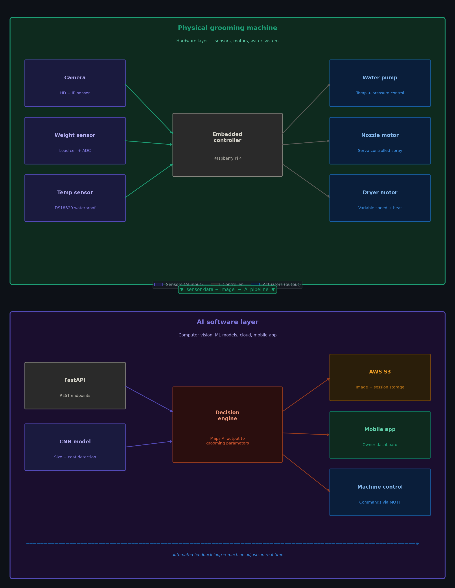
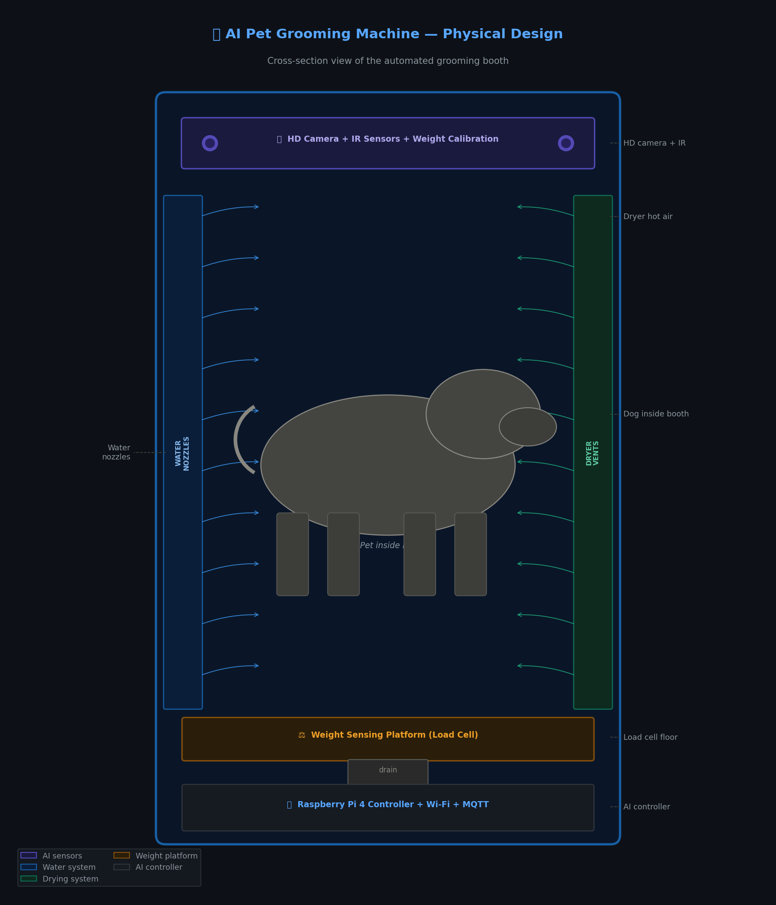

# 🐾 AI-Powered Pet Grooming System

> **This is an original startup concept and project by [Nithin Mude Naik](https://www.linkedin.com/in/mudenithin). All rights reserved under MIT License. © 2025 Nithin Mude Naik.**

---

## The Vision

The pet grooming industry is a **$11 billion market** in the US alone — yet it's still almost entirely manual. Long wait times, inconsistent results, and high costs frustrate millions of pet owners every year.

**My solution:** An AI-powered automated grooming booth that uses computer vision to detect a dog's size and coat type, then automatically configures water temperature, pressure, shampoo type, and drying settings — with zero human intervention.

Think of it as the **"car wash for dogs"** — but smart.

---

## How It Works

```
Dog enters booth
      ↓
Camera + sensors scan the dog (size, weight, coat type)
      ↓
CNN model classifies: breed / size / coat
      ↓
AI decision engine sets grooming parameters
      ↓
Machine auto-adjusts: water temp, pressure, nozzles, dryer
      ↓
Owner gets report on mobile app
```

---

## System Architecture



---

## Machine Design



---

## Features

- **Dog size detection** — Small / Medium / Large / Extra Large
- **Coat type analysis** — Short, Long, Curly, Double Coat, Wire
- **Automated grooming parameters** — wash temp, duration, shampoo, brush type
- **Real-time mobile app** — owners monitor the session remotely
- **Cloud storage** — every session saved to AWS S3
- **REST API** — FastAPI backend, fully documented

---

## Tech Stack

| Layer | Technology |
|---|---|
| AI Vision | CNN (MobileNetV2), Claude Vision API |
| Backend | FastAPI + Python |
| Hardware | Raspberry Pi 4, servo motors, load cells |
| Cloud | AWS S3 + EC2 |
| Mobile | REST API (app coming soon) |
| Deployment | Docker |

---

## Project Structure

```
ai-pet-grooming-system/
├── main.py                  # FastAPI backend
├── templates/
│   └── index.html           # Web interface
├── requirements.txt
├── Dockerfile
├── .env.example
├── LICENSE
├── architecture.png         # System architecture diagram
├── machine-design.png       # Physical machine design
└── README.md
```

---

## Run Locally

```bash
git clone https://github.com/mudenithinnaik/ai-pet-grooming-system.git
cd ai-pet-grooming-system
pip install -r requirements.txt
cp .env.example .env        
python main.py
```

Visit `http://localhost:8000`

---

## Roadmap

- [x] AI size + coat detection (web app)
- [x] FastAPI backend + AWS S3 integration
- [x] System architecture diagram
- [x] Physical machine design
- [ ] Hardware prototype (Raspberry Pi)
- [ ] Mobile app (iOS + Android)
- [ ] Patent filing
- [ ] Pilot with local pet grooming salons

---

## About the Founder

**Nithin Mude Naik**
MS Computer Science — St. Francis College, New York
Specialization: Machine Learning & AI

This project is my dream startup. I am actively building the hardware prototype and seeking collaborators, advisors, and early investors.

📧 nmude@sfc.edu
🔗 [LinkedIn](https://www.linkedin.com/in/mudenithin)
🌍 New Jersey, USA

---

## License

MIT License — © 2025 Nithin Mude Naik.
You are free to use this code with attribution. Commercial use of this concept requires written permission from the author.

---

> *"The best time to build your dream is now."*
> — Nithin Mude Naik
